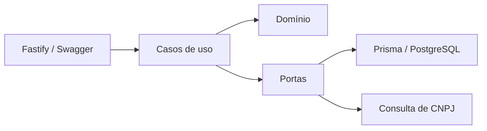

# API Fiscal

API em Node.js/TypeScript para a plataforma de gestão fiscal e inteligência contábil. A primeira fatia implementa o início do plano **Control**, com o cadastro automático de empresas por CNPJ (F52).

## O que já existe

- Fastify com OpenAPI/Swagger em `/docs`
- PostgreSQL com Prisma
- arquitetura modular orientada a domínio
- injeção de dependência com Awilix
- validação do CNPJ no domínio
- consulta cadastral por adaptador substituível
- isolamento de empresas por escritório
- criação da empresa e auditoria na mesma transação
- tabela inicial de parâmetros fiscais por vigência (RNF-03)
- testes unitários com Vitest

## Arquitetura



O Prisma e a integração externa ficam nos adaptadores. Os casos de uso dependem apenas de interfaces, o que permite testar regras sem banco ou internet.

## Executar localmente

Pré-requisitos: Node.js 22+, Docker e Docker Compose.

```bash
npm install
export POSTGRES_USER=<usuario-local>
export POSTGRES_PASSWORD=<senha-local-segura>
export POSTGRES_DB=<banco-local>
export DATABASE_URL=<url-postgresql-local>
docker compose up -d
npm run prisma:generate
npm run db:migrate -- --name init
npm run db:seed
npm run dev
```

Acesse:

- API: `http://localhost:3333`
- Swagger: `http://localhost:3333/docs`
- Saúde: `GET http://localhost:3333/health`

O seed cria o escritório de desenvolvimento:

```text
00000000-0000-4000-8000-000000000001
```

Exemplo:

```bash
curl -X POST http://localhost:3333/v1/control/companies \
  -H "content-type: application/json" \
  -d '{
    "tenantId": "00000000-0000-4000-8000-000000000001",
    "cnpj": "11.222.333/0001-81"
  }'
```

## Qualidade

```bash
npm run lint
npm test
npm run build
```

## Limites desta primeira entrega

- Ainda não há autenticação e autorização; o `tenantId` é informado na requisição apenas para desenvolvimento.
- As credenciais locais devem ser fornecidas por variáveis de ambiente e nunca versionadas.
- A BrasilAPI é o primeiro adaptador de consulta cadastral, não uma garantia de fonte oficial ou SLA de produção.
- Nenhuma faixa, alíquota, sublimite ou prazo fiscal foi codificado.
- Os demais itens do Control estão priorizados em [docs/control-roadmap.md](docs/control-roadmap.md).
