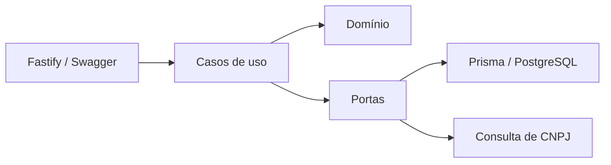

# API Fiscal

API em Node.js/TypeScript para a plataforma de gestão fiscal e inteligência contábil. A fundação do plano **Control** inclui acesso multi-escritório seguro e o cadastro automático de empresas por CNPJ (F52).

## O que já existe

- Fastify com OpenAPI/Swagger em `/docs`
- PostgreSQL com Prisma
- arquitetura modular orientada a domínio
- injeção de dependência com Awilix
- cadastro de escritório e usuário proprietário
- autenticação JWT com vínculo e papel validados a cada requisição
- MFA obrigatório por TOTP para proprietários e administradores
- códigos de recuperação MFA de uso único
- recuperação de senha com token de uso único e resposta anti-enumeração
- invalidação imediata dos JWTs e refresh tokens após redefinição de senha
- refresh token rotativo, logout e detecção de reutilização de token
- rate limiting nas rotas públicas de autenticação
- papéis `OWNER`, `ADMIN`, `ACCOUNTANT` e `VIEWER`
- convite de usuários com token de uso único armazenado como hash
- senhas derivadas com `scrypt` e salt individual
- validação do CNPJ no domínio
- consulta cadastral por adaptador substituível
- isolamento de empresas por escritório
- criação da empresa e auditoria na mesma transação
- tabela inicial de parâmetros fiscais por vigência (RNF-03)
- testes unitários com Vitest

## Arquitetura



O Prisma e a integração externa ficam nos adaptadores. Os casos de uso dependem apenas de interfaces, o que permite testar regras sem banco ou internet.

## Executar localmente

Pré-requisitos: Node.js 22+, Docker e Docker Compose.

```bash
npm install
export POSTGRES_USER=<usuario-local>
export POSTGRES_PASSWORD=<senha-local-segura>
export POSTGRES_DB=<banco-local>
export DATABASE_URL=<url-postgresql-local>
export JWT_SECRET=<segredo-aleatorio-com-pelo-menos-32-caracteres>
export MFA_ENCRYPTION_KEY=<chave-independente-com-pelo-menos-32-caracteres>
export MFA_ISSUER="API Fiscal"
export ENABLE_SWAGGER_UI=true
export REFRESH_TOKEN_TTL_DAYS=30
export AUTH_RATE_LIMIT_MAX=10
export AUTH_RATE_LIMIT_WINDOW_MS=60000
export EXPOSE_RECOVERY_TOKENS=true
export SEED_OWNER_EMAIL=<email-local>
export SEED_OWNER_PASSWORD=<senha-local-forte>
docker compose up -d
npm run prisma:generate
npm run db:migrate -- --name init
npm run db:seed
npm run dev
```

Acesse:

- API: `http://localhost:3333`
- Swagger: `http://localhost:3333/docs` quando `ENABLE_SWAGGER_UI=true`
- OpenAPI JSON: `http://localhost:3333/openapi.json`
- Saúde: `GET http://localhost:3333/health`

O seed cria o escritório de desenvolvimento e vincula o proprietário informado nas variáveis acima:

```text
00000000-0000-4000-8000-000000000001
```

No primeiro login de `OWNER` ou `ADMIN`, a API devolve
`MFA_SETUP_REQUIRED`, o segredo e a URI `otpauth://`. Depois de adicionar a
conta ao aplicativo autenticador, confirme o código em
`POST /v1/auth/mfa/verify`. A resposta contém o JWT, o refresh token e oito
códigos de recuperação exibidos uma única vez.

`EXPOSE_RECOVERY_TOKENS=true` serve apenas para desenvolvimento enquanto o
adaptador de e-mail não é conectado. Em produção, mantenha `false`.

Mantenha também `ENABLE_SWAGGER_UI=false` em produção. A interface interativa
usa um servidor de arquivos e deve ficar restrita ao desenvolvimento; o contrato
OpenAPI permanece disponível em `/openapi.json`.

Exemplo após concluir o MFA:

```bash
TOKEN=$(curl -s -X POST http://localhost:3333/v1/auth/login \
  -H "content-type: application/json" \
  -d '{
    "tenantSlug": "escritorio-demo",
    "email": "<email-local>",
    "password": "<senha-local-forte>"
  }' | jq -r .accessToken)

curl -X POST http://localhost:3333/v1/control/companies \
  -H "content-type: application/json" \
  -H "authorization: Bearer $TOKEN" \
  -d '{
    "cnpj": "11.222.333/0001-81"
  }'
```

O `tenantId` e o autor da operação são derivados do token autenticado. Eles não são aceitos no corpo ou em cabeçalhos informados pelo cliente.

## Qualidade

```bash
npm run lint
npm test
npm run test:integration
npm run build
```

`npm run test:integration` exige PostgreSQL com as migrações aplicadas. No GitHub,
o workflow de CI sobe um banco isolado e executa schema, migrações, testes
unitários, testes de integração, checagem de tipos e build.

## Limites desta primeira entrega

- Convites são retornados pela API uma única vez; o envio por e-mail ainda será integrado.
- A entrega de convites e tokens de recuperação por e-mail ainda será integrada.
- O rate limiting atual usa memória do processo; antes de escalar horizontalmente,
  deve usar um armazenamento compartilhado.
- Sessões expiradas precisam de uma rotina periódica de limpeza e política de retenção.
- As credenciais locais devem ser fornecidas por variáveis de ambiente e nunca versionadas.
- A BrasilAPI é o primeiro adaptador de consulta cadastral, não uma garantia de fonte oficial ou SLA de produção.
- Nenhuma faixa, alíquota, sublimite ou prazo fiscal foi codificado.
- Os demais itens do Control estão priorizados em [docs/control-roadmap.md](docs/control-roadmap.md).
